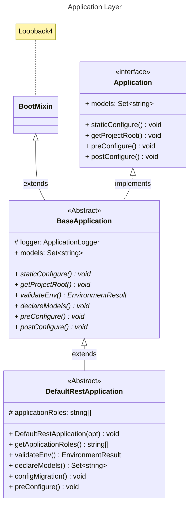

## Loopback 4 Infrastructure

Require to pre-setup ENV:

```env
# Application
APP_ENV_APPLICATION_NAME
APP_ENV_APPLICATION_TIMEZONE
APP_ENV_DATASOURCE_NAME
APP_ENV_APPLICATION_DS_MIGRATION
APP_ENV_APPLICATION_DS_AUTHORIZE
APP_ENV_LOGGER_FOLDER_PATH
APP_ENV_APPLICATION_SECRET
APP_ENV_APPLICATION_ROLES

# Server
APP_ENV_SERVER_HOST
APP_ENV_SERVER_PORT
APP_ENV_SERVER_BASE_PATH

# PostgreSQL
APP_ENV_POSTGRES_HOST
APP_ENV_POSTGRES_PORT
APP_ENV_POSTGRES_USERNAME
APP_ENV_POSTGRES_PASSWORD
APP_ENV_POSTGRES_DATABASE
```

## The highest level of Lb-infra is `Application`

### Application

In Lb-infra we can extends from 2 kind of classes:

- `BaseApplication`: This abstract class is very basic which extends from `Loopback 4`
-  `DefaultRestApplication`: This is a class that implements `BaseApplication` class.

#### Class Diagram for Application Layer:

<i> -> We have to extends from 2 of those classes to create a new application.</i>

#### Usage Application:

```ts
import { DefaultRestApplication } from '@lb/infra';

class MyApplication extends DefaultRestApplication {
  constructor(serverOptions: ApplicationConfig = {}) {
    super({ serverOptions });
  }

//Run application
const serverProps = {
  port: +(process.env.APP_ENV_SERVER_PORT ?? 3000),
  host: process.env.APP_ENV_SERVER_HOST,
  basePath: process.env.APP_ENV_SERVER_BASE_PATH,
};

export const beConfigs = {
  rest: {
    ...serverProps,
    gracePeriodForClose: 5000,
    openApiSpec: {
      endpointMapping: {
        '/openapi.json': { version: '3.0.0', format: 'json' },
        '/openapi.yaml': { version: '3.0.0', format: 'yaml' },
      },
      servers: [{ url: process.env.APP_ENV_APPLICATION_EXPLORER_URL }],
    },
    cors: {
      origin: '*',
      methods: 'GET,HEAD,PUT,PATCH,POST,DELETE,OPTIONS',
      preflightContinue: false,
      optionsSuccessStatus: 204,
      maxAge: 86400,
      credentials: true,
    },
    requestBodyParser: {
      json: { limit: '10mb' },
    },
  },
};

const runApplication = async () => {
  const app = new MyApplication(beConfigs);
  applicationContext.bind(BindingKeys.APPLICATION_INSTANCE).to(app);

  logger.info(' Getting ready to start up %s Application...', applicationName);
  await app.boot();
  await app.start();

  const logFolder = path.resolve(__dirname, process.env.APP_ENV_LOGGER_FOLDER_PATH ?? '').toString();
  const { url } = app.restServer;
  logger.info(' %s Server is now running...', applicationName);
  logger.info(' Server URL: %s', url);
  logger.info(' Log folder: %s', logFolder);
  return app;
};
```
