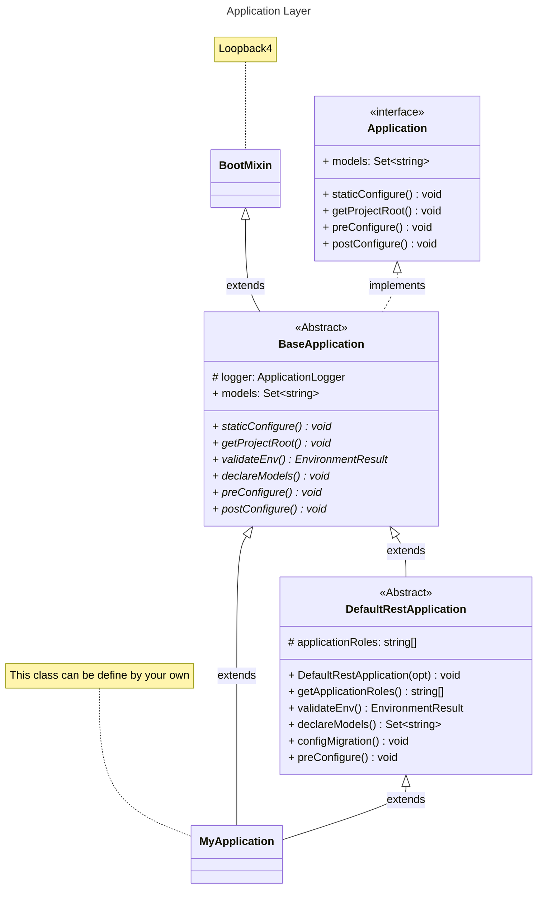

## Loopback 4 Infrastructure

Require to pre-setup ENV:

```env
# Application
APP_ENV_APPLICATION_NAME
APP_ENV_APPLICATION_TIMEZONE
APP_ENV_DATASOURCE_NAME
APP_ENV_APPLICATION_DS_MIGRATION
APP_ENV_APPLICATION_DS_AUTHORIZE
APP_ENV_LOGGER_FOLDER_PATH
APP_ENV_APPLICATION_SECRET
APP_ENV_APPLICATION_ROLES

# Server
APP_ENV_SERVER_HOST
APP_ENV_SERVER_PORT
APP_ENV_SERVER_BASE_PATH

# PostgreSQL
APP_ENV_POSTGRES_HOST
APP_ENV_POSTGRES_PORT
APP_ENV_POSTGRES_USERNAME
APP_ENV_POSTGRES_PASSWORD
APP_ENV_POSTGRES_DATABASE
```

## The highest level of Lb-infra is `Application`

### Application:

In Lb-infra we can extends from 2 kind of classes:

- `BaseApplication`: This abstract class is very basic which extends from `Loopback 4`
- `DefaultRestApplication`: This is a class that implements `BaseApplication` class.

#### Class Diagram for Application Layer:



<i> -> We have to extends from 1 of those classes to create a new application.</i>

#### Usage Application with DefaultRestApplication:

```ts
import { DefaultRestApplication } from '@lb/infra';

class MyApplication extends DefaultRestApplication {
  constructor(serverOptions: ApplicationConfig = {}) {
    super({ serverOptions });
  }

//Run application
const serverProps = {
  port: +(process.env.APP_ENV_SERVER_PORT ?? 3000),
  host: process.env.APP_ENV_SERVER_HOST,
  basePath: process.env.APP_ENV_SERVER_BASE_PATH,
};

export const beConfigs = {
  rest: {
    ...serverProps,
    gracePeriodForClose: 5000,
    openApiSpec: {
      endpointMapping: {
        '/openapi.json': { version: '3.0.0', format: 'json' },
        '/openapi.yaml': { version: '3.0.0', format: 'yaml' },
      },
      servers: [{ url: process.env.APP_ENV_APPLICATION_EXPLORER_URL }],
    },
    cors: {
      origin: '*',
      methods: 'GET,HEAD,PUT,PATCH,POST,DELETE,OPTIONS',
      preflightContinue: false,
      optionsSuccessStatus: 204,
      maxAge: 86400,
      credentials: true,
    },
    requestBodyParser: {
      json: { limit: '10mb' },
    },
  },
};

const runApplication = async () => {
  const app = new MyApplication(beConfigs);
  applicationContext.bind(BindingKeys.APPLICATION_INSTANCE).to(app);

  logger.info(' Getting ready to start up %s Application...', applicationName);
  await app.boot();
  await app.start();

  const logFolder = path.resolve(__dirname, process.env.APP_ENV_LOGGER_FOLDER_PATH ?? '').toString();
  const { url } = app.restServer;
  logger.info(' %s Server is now running...', applicationName);
  logger.info(' Server URL: %s', url);
  logger.info(' Log folder: %s', logFolder);
  return app;
};
```

<hr>
### Models:

#### Base Models:

We have a set of base models which **enhanced** default models of Loopback4:

- **BaseEntity**: extends class `Entity` by default of Loopback 4

```ts
class BaseEntity extends Entity {}
```

- **BaseIdEntity**: extends class `BaseEntity`, override property `id` with type `number` and `generated: true`

```ts
class BaseIdEntity extends BaseEntity {
  @property({ type: 'number', id: true, generated: true })
  id: number;
}
```

- **BaseStringIdEntity**: extends `BaseEntity`, override id with type `string` and `generated: true`

```ts
class BaseStringIdEntity extends BaseEntity {
  @property({ type: 'string', id: true })
  id: string;
}
```

- **BaseKVEntity**: extends `BaseEntity` property `type: object`, `payload: any`

```ts
class BaseKVEntity extends BaseEntity {
  @property({ type: 'object' })
  payload: any;
}
```

- **BaseTzEntity**: extends `TzMixin`, input of `TzMixin` is `BaseIdEntity` class

```ts
class BaseTzEntity extends TzMixin(BaseIdEntity) {}
```

- **BaseUserAuditTzEntity**: extends `UserAuditMixin`, input of `UserAuditMixin` is `BaseTzEntity` class

```ts
class BaseUserAuditTzEntity extends UserAuditMixin(BaseTzEntity) {}
```

- **BaseUserAuditTzEntity**: extends `DataTypeMixin`, input of `DataTypeMixin` is `BaseTzEntity` class

```ts
class BaseDataTypeTzEntity extends DataTypeMixin(BaseTzEntity) {}
```

- **BaseTextSearchTzEntity**: extends `TextSearchMixin`, input of `TextSearchMixin` is `BaseTzEntity` class

```ts
class BaseTextSearchTzEntity extends TextSearchMixin(BaseTzEntity) {}
```

#### Enhanced Custom Models from Base Models:

##### 1. Models relate to authorize:

- `defineUser()`: return an enhanced User model.

```ts
const defineUser = () => {
  class User extends BaseTzEntity {
    @property({
      type: 'string',
    })
    realm?: string;

    @property({
      type: 'string',
      default: UserStatuses.UNKNOWN,
      postgresql: {
        columnName: 'status',
        dataType: 'text',
      },
    })
    status: string;

    @property({
      type: 'string',
      default: UserTypes.SYSTEM,
      postgresql: {
        columnName: 'user_type',
        dataType: 'text',
      },
    })
    userType?: string;

    @property({
      type: 'date',
      postgresql: {
        columnName: 'activated_at',
        dataType: 'TIMESTAMPTZ',
      },
    })
    activatedAt?: Date;

    @property({
      type: 'date',
      postgresql: {
        columnName: 'last_login_at',
        dataType: 'TIMESTAMPTZ',
      },
    })
    lastLoginAt?: Date;

    @property({
      type: 'number',
      postgresql: {
        columnName: 'parent_id',
      },
    })
    parentId: number;

    constructor(data?: Partial<User>) {
      super(data);
    }
  }

  return User;
};
```

- `defineRole()`: return an enhanced Role model.

```ts
const defineRole = () => {
  class Role extends BaseTzEntity {
    @property({
      type: 'string',
      require: true,
    })
    identifier: string;

    @property({
      type: 'string',
      require: true,
    })
    name: string;

    @property({
      type: 'string',
    })
    description?: string;

    @property({
      type: 'number',
    })
    priority: number;

    @property({
      type: 'string',
      default: RoleStatuses.ACTIVATED,
    })
    status: string;

    constructor(data?: Partial<Role>) {
      super(data);
    }
  }

  return Role;
};
```

- `definePermission()`: return an enhanced Permission model.

```ts
const definePermission = () => {
  class Permission extends BaseTzEntity {
    @property({
      type: 'string',
    })
    code: string;

    @property({
      type: 'string',
    })
    name: string;

    @property({
      type: 'string',
    })
    subject: string;

    @property({
      type: 'string',
      postgresql: { columnName: 'p_type' },
    })
    pType: string;

    @property({
      type: 'string',
    })
    action: string;

    @property({
      type: 'number',
      postgresql: { columnName: 'parent_id' },
    })
    parentId: number;

    @property({
      type: 'object',
      postgresql: { columnName: 'details' },
    })
    details: any;

    constructor(data?: Partial<Permission>) {
      super(data);
    }
  }

  return Permission;
};
```

- `definePermissionMapping()`: return an enhanced PermissionMapping model.

```ts
const definePermissionMapping = () => {
  class PermissionMapping extends BaseTzEntity {
    @property({
      type: 'number',
      postgresql: { columnName: 'user_id' },
    })
    userId: number;

    @property({
      type: 'number',
      postgresql: { columnName: 'role_id' },
    })
    roleId: number;

    @property({
      type: 'number',
      postgresql: { columnName: 'permission_id' },
    })
    permissionId: number;

    @property({ type: 'string' })
    effect: string;

    constructor(data?: Partial<PermissionMapping>) {
      super(data);
    }
  }
  return PermissionMapping;
};
```

- `defineUserRole()`: return an enhanced UserRole model extends `PrincipalMixin` with principal class is Role.

```ts
const defineUserRole = () => {
  class UserRole extends PrincipalMixin(BaseTzEntity, 'Role', 'number') {
    @property({
      type: 'number',
      postgresql: { columnName: 'user_id' },
    })
    userId: number;

    constructor(data?: Partial<UserRole>) {
      super(data);
    }
  }
  return UserRole;
};
```
##### 2. Usage enhanced models:
1. You can define models based on 5 function defined above.
2. You can reuse the models which implemented from 5 those above.
```ts
// An example of using one of 5 function defined models before.
// user-role.model.ts which implemented defineUserRole()
const BaseUserRole = defineUserRole();

@model({
  settings: {
    postgresql: {
      schema: 'public',
      table: 'UserRole',
    },
    hiddenProperties: ['createdAt', 'modifiedAt'],
  },
})
export class UserRole extends BaseUserRole {
  constructor(data?: Partial<UserRole>) {
    super(data);
  }
}
```


##### 3. Models relate to migration:

```ts
@model({
  settings: {
    postgresql: {
      schema: 'public',
      table: 'Migration',
    },
    strict: true,
    indexes: {
      INDEX_UNIQUE_NAME: {
        keys: { name: 1 },
        options: { unique: true },
      },
    },
  },
})
export class Migration extends BaseTzEntity {
  @property({
    type: 'string',
    required: true,
  })
  name: string;

  @property({
    type: 'string',
    default: MigrationStatuses.UNKNOWN,
  })
  status: string;

  constructor(data?: Partial<Migration>) {
    super(data);
  }
}
```

##### 4. Model for ViewAuthorizePolicy:
```ts
@model({
  settings: {
    postgresql: {
      schema: 'public',
      table: 'ViewAuthorizePolicy',
    },
    indexes: {
      INDEX_UNIQUE_SUBJECT: {
        keys: { subject: 1 },
        options: { unique: true },
      },
    },
  },
})
export class ViewAuthorizePolicy extends BaseEntity {
  @property({ type: 'string', id: true })
  id: StringIdType;

  @property({
    type: 'string',
    postgresql: {
      columnName: 'subject',
    },
  })
  subject: string;

  @property({
    type: 'string',
    postgresql: {
      columnName: 'subject_type',
    },
  })
  subjectType: string;

  @property({
    type: 'string',
    postgresql: {
      columnName: 'subject_id',
    },
  })
  subjectId: IdType;

  constructor(data?: Partial<ViewAuthorizePolicy>) {
    super(data);
  }
}
```
<hr>
### Mixins:
#### These Mixins are useful to define models
1.  Timezone Mixin (`TzMixin`) has 2 properties:
- createdAt: Date
- modifiedAt: Date
```ts
const TzMixin = <E extends MixinTarget<Entity>>(superClass: E) => {
  class Mixed extends superClass {
    @property({
      type: 'date',
      defaultFn: 'now',
      postgresql: {
        columnName: 'created_at',
        dataType: 'TIMESTAMPTZ',
      },
    })
    createdAt: Date;

    @property({
      type: 'date',
      defaultFn: 'now',
      postgresql: {
        columnName: 'modified_at',
        dataType: 'TIMESTAMPTZ',
      },
    })
    modifiedAt: Date;
  }

  return Mixed;
}

````
2. Text-Search Mixin (`TextSearchMixin`) has 1 properties:
- textSearch?: string
```ts
const TextSearchMixin = <E extends MixinTarget<Entity>>(superClass: E) => {
 class Mixed extends superClass {
  @property({
    type: 'string',
    hidden: true,
    postgresql: {
      columnName: 'text_search',
      dataType: 'text',
    }
  })
  textSearch?: string;

 }
 return Mixed;
}
````

3. Principal Mixin (`PrincipalMixin`) has 2 properties:

- `principalIdType`?: string
- `principalId`?: IdType

```ts
const PrincipalMixin = <E extends MixinTarget<Entity>>(
  superClass: E,
  defaultPrincipalType: string,
  principalIdType: 'number' | 'string',
) => {
  class Mixed extends superClass {
    @property({
      type: 'string',
      default: defaultPrincipalType,
      postgresql: {
        columnName: 'principal_type',
        dataType: 'text',
      },
    })
    principalType?: string;

    @property({
      type: principalIdType,
      postgresql: {
        columnName: 'principal_id',
        dataType: principalIdType === 'number' ? 'integer' : 'text',
      },
    })
    principalId?: IdType;
  }

  return Mixed;
};

// Example:
class UserAccount extends PrincipalMixin(BaseTzEntity, 'Account', 'number') {
  @belongsTo(
    () => User,
    { keyFrom: 'userId' },
    {
      postgresql: {
        columnName: 'user_id',
      },
    },
  )
  userId: NumberIdType;

  constructor(data?: Partial<UserAccount>) {
    super(data);
  }
}
```

4. User audit Mixin (`UserAuditMixin`) has 2 properties:

- createdBy: IdType
- modifiedBy: IdType

```ts
const UserAuditMixin = <E extends MixinTarget<Entity>>(superClass: E) => {
  class Mixed extends superClass {
    @property({
      type: 'number',
      postgresql: {
        columnName: 'created_by',
        dataType: 'number',
      },
      hidden: true,
    })
    createdBy: IdType;

    @property({
      type: 'number',
      postgresql: {
        columnName: 'modified_by',
        dataType: 'number',
      },
      hidden: true,
    })
    modifiedBy: IdType;
  }

  return Mixed;
};
```

5. Date type Mixin (`DataTypeMixin`) has properties:

- tValue?: string
- nValue?: number
- jValue?: any --> property type `object`
- bValue?: number[] --> property type `Buffer`
- dataType?: string

```ts
const DataTypeMixin = <E extends MixinTarget<Entity>>(superClass: E) => {
  class Mixed extends superClass {
    @property({
      type: 'string',
      postgresql: {
        columnName: 't_value',
        dataType: 'text',
      },
    })
    tValue?: string;

    @property({
      type: 'number',
      postgresql: { columnName: 'n_value' },
    })
    nValue?: number;

    @property({
      type: 'object',
      postgresql: {
        columnName: 'j_value',
        dataType: 'jsonb',
      },
    })
    jValue?: any;

    @property({
      type: 'buffer',
      postgresql: {
        columnName: 'b_value',
        dataType: 'bytea',
      },
    })
    bValue?: number[];

    @property({
      type: 'string',
      postgresql: {
        columnName: 'data_type',
        dataType: 'text',
      },
    })
    dataType?: string;
  }

  return Mixed;
};
```
