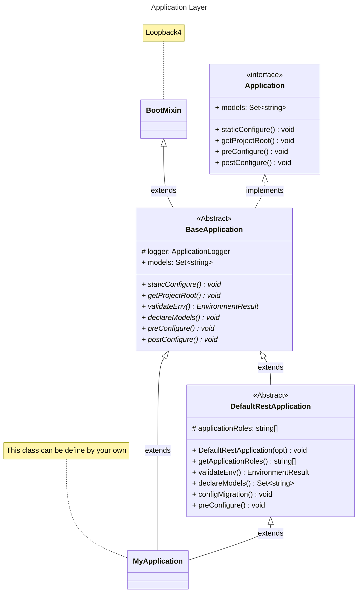
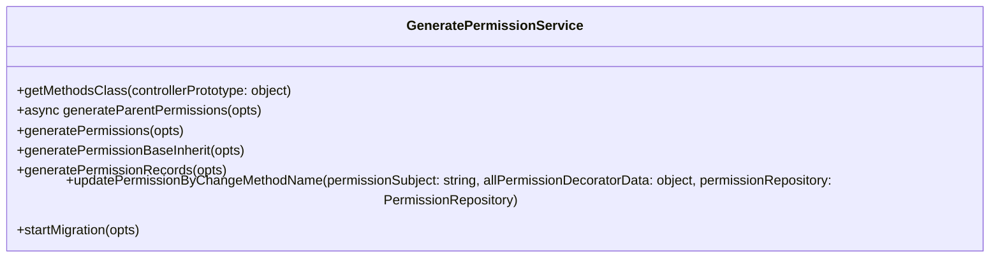

## Loopback 4 Infrastructure

Require to pre-setup ENV:

```env
# Application
APP_ENV_APPLICATION_NAME
APP_ENV_APPLICATION_TIMEZONE
APP_ENV_DATASOURCE_NAME
APP_ENV_APPLICATION_DS_MIGRATION
APP_ENV_APPLICATION_DS_AUTHORIZE
APP_ENV_LOGGER_FOLDER_PATH
APP_ENV_APPLICATION_SECRET
APP_ENV_APPLICATION_ROLES

# Server
APP_ENV_SERVER_HOST
APP_ENV_SERVER_PORT
APP_ENV_SERVER_BASE_PATH

# PostgreSQL
APP_ENV_POSTGRES_HOST
APP_ENV_POSTGRES_PORT
APP_ENV_POSTGRES_USERNAME
APP_ENV_POSTGRES_PASSWORD
APP_ENV_POSTGRES_DATABASE
```

## The highest level of Lb-infra is `Application`

### Application:

In Lb-infra we can extends from 2 kind of classes:

- `BaseApplication`: This abstract class is very basic which extends from `Loopback 4`
- `DefaultRestApplication`: This is a class that implements `BaseApplication` class.

#### Class Diagram for Application Layer:



<i> -> We have to extends from 1 of those classes to create a new application.</i>

#### Usage Application with DefaultRestApplication:

```ts
import { DefaultRestApplication } from '@lb/infra';

class MyApplication extends DefaultRestApplication {
  constructor(serverOptions: ApplicationConfig = {}) {
    super({ serverOptions });
  }

//Run application
const serverProps = {
  port: +(process.env.APP_ENV_SERVER_PORT ?? 3000),
  host: process.env.APP_ENV_SERVER_HOST,
  basePath: process.env.APP_ENV_SERVER_BASE_PATH,
};

export const beConfigs = {
  rest: {
    ...serverProps,
    gracePeriodForClose: 5000,
    openApiSpec: {
      endpointMapping: {
        '/openapi.json': { version: '3.0.0', format: 'json' },
        '/openapi.yaml': { version: '3.0.0', format: 'yaml' },
      },
      servers: [{ url: process.env.APP_ENV_APPLICATION_EXPLORER_URL }],
    },
    cors: {
      origin: '*',
      methods: 'GET,HEAD,PUT,PATCH,POST,DELETE,OPTIONS',
      preflightContinue: false,
      optionsSuccessStatus: 204,
      maxAge: 86400,
      credentials: true,
    },
    requestBodyParser: {
      json: { limit: '10mb' },
    },
  },
};

const runApplication = async () => {
  const app = new MyApplication(beConfigs);
  applicationContext.bind(BindingKeys.APPLICATION_INSTANCE).to(app);

  logger.info(' Getting ready to start up %s Application...', applicationName);
  await app.boot();
  await app.start();

  const logFolder = path.resolve(__dirname, process.env.APP_ENV_LOGGER_FOLDER_PATH ?? '').toString();
  const { url } = app.restServer;
  logger.info(' %s Server is now running...', applicationName);
  logger.info(' Server URL: %s', url);
  logger.info(' Log folder: %s', logFolder);
  return app;
};
```

<hr>

### Models:

#### Base Models:

We have a set of base models which **enhanced** default models of Loopback4:

- **BaseEntity**: extends class `Entity` by default of Loopback 4

```ts
class BaseEntity extends Entity {}
```

- **BaseIdEntity**: extends class `BaseEntity`, override property `id` with type `number` and `generated: true`

```ts
class BaseIdEntity extends BaseEntity {
  @property({ type: 'number', id: true, generated: true })
  id: number;
}
```

- **BaseStringIdEntity**: extends `BaseEntity`, override id with type `string` and `generated: true`

```ts
class BaseStringIdEntity extends BaseEntity {
  @property({ type: 'string', id: true })
  id: string;
}
```

- **BaseKVEntity**: extends `BaseEntity` property `type: object`, `payload: any`

```ts
class BaseKVEntity extends BaseEntity {
  @property({ type: 'object' })
  payload: any;
}
```

- **BaseTzEntity**: extends `TzMixin`, input of `TzMixin` is `BaseIdEntity` class

```ts
class BaseTzEntity extends TzMixin(BaseIdEntity) {}
```

- **BaseUserAuditTzEntity**: extends `UserAuditMixin`, input of `UserAuditMixin` is `BaseTzEntity` class

```ts
class BaseUserAuditTzEntity extends UserAuditMixin(BaseTzEntity) {}
```

- **BaseUserAuditTzEntity**: extends `DataTypeMixin`, input of `DataTypeMixin` is `BaseTzEntity` class

```ts
class BaseDataTypeTzEntity extends DataTypeMixin(BaseTzEntity) {}
```

- **BaseTextSearchTzEntity**: extends `TextSearchMixin`, input of `TextSearchMixin` is `BaseTzEntity` class

```ts
class BaseTextSearchTzEntity extends TextSearchMixin(BaseTzEntity) {}
```

#### Enhanced Custom Models from Base Models:

Instead of create models by hand we have:

- `defineUser()`: return User model.
- `defineRole()`: return Role model.
- `definePermission()`: return Permission model.
- `definePermissionMapping()`: return PermissionMapping model.
- `defineUserRole()`: return UserRole model extends `PrincipalMixin` with principal class is Role.

##### 2. Usage enhanced models:

1. You can define models based on 5 function defined above.
2. You can reuse the models which implemented from 5 those above.

```ts
// An example of using one of 5 function defined models before.
// user-role.model.ts which implemented defineUserRole()
const BaseUserRole = defineUserRole();

@model({
  settings: {
    postgresql: {
      schema: 'public',
      table: 'UserRole',
    },
    hiddenProperties: ['createdAt', 'modifiedAt'],
  },
})
export class UserRole extends BaseUserRole {
  constructor(data?: Partial<UserRole>) {
    super(data);
  }
}
```

<hr>

### Mixins:

Read more on: https://loopback.io/doc/en/lb4/Mixin.html

#### These Mixins are useful to define models

1.  Timezone Mixin (`TzMixin`) has 2 properties:

- This mixin will include 2 properties is create_adt, modified_at as default
- You can pass, your model to extends 2 those properties from TZMixin

2. Text-Search Mixin (`TextSearchMixin`) has 1 properties:

- textSearch?: string

```ts
const TextSearchMixin = <E extends MixinTarget<Entity>>(superClass: E) => {
  class Mixed extends superClass {
    @property({
      type: 'string',
      hidden: true,
      postgresql: {
        columnName: 'text_search',
        dataType: 'text',
      },
    })
    textSearch?: string;
  }
  return Mixed;
};
```

3. Principal Mixin (`PrincipalMixin`) has 2 properties:

- `principalType`?: string -> the parent you will refer
- `principalId`?: IdType ->the parent id of the table you extends

```ts
// Example:
class UserRole extends PrincipalMixin(BaseTzEntity, 'Account', 'number') {
  @belongsTo(
    () => User,
    { keyFrom: 'userId' },
    {
      postgresql: {
        columnName: 'user_id',
      },
    },
  )
  userId: NumberIdType;

  constructor(data?: Partial<UserRole>) {
    super(data);
  }
}
```

The result of migrate this model will be:

Table: `UserRole`
id | create_at | modified_at | principle_type | principle_id | user_id
--- | --- | --- | --- |--- |---
1|2023-12-15 08:50:49.019000 +00:00|2023-12-15 10:44:25.348000 +00:00|Role|35|2

Description:

- UserRole id 1 we have a principle type is `Role` that means we have the link from `UserRole` -> `Role` and the `role_id` is 35 for `user_id`: 2

4. User audit Mixin (`UserAuditMixin`) :
5. Date type Mixin (`DataTypeMixin`) has properties:

- tValue?: string
- nValue?: number
- jValue?: any --> property type `object`
- bValue?: number[] --> property type `Buffer`
- dataType?: string

```ts
const DataTypeMixin = <E extends MixinTarget<Entity>>(superClass: E) => {
  class Mixed extends superClass {
    @property({
      type: 'string',
      postgresql: {
        columnName: 't_value',
        dataType: 'text',
      },
    })
    tValue?: string;

    @property({
      type: 'number',
      postgresql: { columnName: 'n_value' },
    })
    nValue?: number;

    @property({
      type: 'object',
      postgresql: {
        columnName: 'j_value',
        dataType: 'jsonb',
      },
    })
    jValue?: any;

    @property({
      type: 'buffer',
      postgresql: {
        columnName: 'b_value',
        dataType: 'bytea',
      },
    })
    bValue?: number[];

    @property({
      type: 'string',
      postgresql: {
        columnName: 'data_type',
        dataType: 'text',
      },
    })
    dataType?: string;
  }

  return Mixed;
};
```

<hr/>

## Authorize and generating permissions:

1. We use `Casbin` for authorization, and we have model format for casbin to handle `Authorize`

Read more: [Casbin](https://casbin.org/docs/get-started)

2. In `AuthorizeComponent` will check the permission of `user/role` in `ViewAuthorityPolicy` table that user has permission or not to make decision to access API

3. We must generate permissions first, then we have class `GeneratePermissionService` to generate automatically permission for all controller you export in path `controllers/index.ts`(\*).

Visual (\*) for the path is mentioned:

```
.
└── .src
    └── controllers
        └── index.ts
        └── user.controller.ts
        └── ...
```

Note:

> 1. Inside `index.ts` you should export all your controller you need to generate permission, which will be store in table `Permission` in `PostgreSQL`
> 2. Then when you create a record in table `PermissionMapping` we need insert `permission_id` + `role_id` + effect `(allow or deny)`, that when we query table `ViewAuthorityPolicy` we will have the policy for `role_id` & `permission_id` will be accessed api which is the methods in your controllers

#### Usage of GeneratePermissionService:

1. We have a class utility for generate permission base on controllers which own many methods inside, methods are extends from base controller of Infra also

2. You can extends the class `GeneratePermissionService` to custom your rule also

Step 1: Write a migratePermission file by your own
Step 2: Write a script for generate permission in package.json

```ts
// STEP 1 >>>> example we create file migrate-permission.ts
// In migrate-permission.ts
import { GeneratePermissionService } from '@lb/infra';
import * as ControllerClasses from './your-controller-path';
import { Application } from './your-path-point-to-your-application';

const migratePermissions = async () => {
  try {
    // your application
    const app = new Application();
    await app.boot();

    const generatePermissionService = new GeneratePermissionService();

    // your permission repository
    const permissionRepository = app.getSync<PermissionRepository>('repositories.PermissionRepository');
    await generatePermissionService.startMigration({ permissionRepository, controllers: ControllerClasses as any });

    process.exit(0);
  } catch (e) {
    console.error('Cannot migrate controllers: ', e);
    process.exit(1);
  }
};

migratePermissions();

// STEP 2 >>>>
// In file -> package.json add script for migrate-permission
// Here is the example, you can rename your script freely:

// "migrate-permission": "npm run build && node --trace-warnings -r dotenv-flow/config ./dist/migrate-permission",
// "generatePermission:production": "NODE_ENV=production RUN_MODE=migrate-permission npm run migrate-permission",
// "generatePermission:dev": "NODE_ENV=development RUN_MODE=migrate-permission npm run migrate-permission",
// "generatePermission:local": "NODE_ENV=local RUN_MODE=migrate-permission npm run migrate-permission",
```

Note:
The script migrate permission have to point to the file you create to generate permission
> "migrate-permission": "npm run build && node --trace-warnings -r dotenv-flow/config ./dist/your-migrate-permission-file",


When you create new APIs that we will run the script and repeat this process when you create new APIs:
Eg:
The script: `yarn generatePermission:local` -> migrate for local database

### Customize generatePermissions:
You can also extends to custom your logic about generate permissions 



Description: 
1. getMethodsClass: get all methods in a class.
2. generateParentPermissions: generate permission for parent permissions.
3. generatePermissionBaseInherit: generate permission for base on controller extends parent class to get suitable methods that avoid redundant generate. 
4. generatePermissionRecords: generate permission for permissions records which finally insert to table `Permission` return `IPermission[]`.
5. updatePermissionByChangeMethodName: update the permission base on `@permission` .
6. startMigration: start migration process which run all methods above.

Eg:

```ts
// In my migrate-permission file

// import things ......
class CustomGeneratePermission extends GeneratePermissionService {

  generatePermissionBaseInherit = (opts: {
    methodsParentsMethods: string[];
    methodsChildClass: string[];
    parentPermission: Permission;
    allPermissionDecoratorData: MetadataMap<unknown> | object;
    parentClassConstructorName?: string;
  }) => {
    const {
      methodsChildClass,
      methodsParentsMethods,
      parentPermission,
      allPermissionDecoratorData,
      parentClassConstructorName,
    } = opts ?? {};

    const defaultPermissions = [
      'count',
      'create',
      'find',
      'findOne',
      'findById',
      'replaceById',
      'updateById',
      'deleteById',
      'updateAll',
    ];

    // Controller not extended from any class
    if (methodsParentsMethods.includes('__proto__')) {
      return this.generatePermissions({
        methods: methodsChildClass,
        permissionSubject: parentPermission.subject,
        parentId: parentPermission.id,
        allPermissionDecoratorData,
      });
    }

    // Controller is extended from Mixin(CrudController)
    if (parentClassConstructorName?.match(/mixin/gim)) {
      return this.generatePermissions({
        methods: union(defaultPermissions, methodsParentsMethods, methodsChildClass),
        permissionSubject: parentPermission.subject,
        parentId: parentPermission.id,
        allPermissionDecoratorData,
      });
    }

    // Controller is extended from CrudController
    return this.generatePermissions({
      methods: union(defaultPermissions, methodsChildClass),
      permissionSubject: parentPermission.subject,
      parentId: parentPermission.id,
      allPermissionDecoratorData,
    });
  };
}

const migratePermissions = async () => {
  try {
    // your application
    const app = new Application();
    await app.boot();

    const generatePermissionService = new CustomGeneratePermission();

    // your permission repository
    const permissionRepository = app.getSync<PermissionRepository>('repositories.PermissionRepository');

    await generatePermissionService.startMigration({ permissionRepository, controllers: ControllerClasses as any });

    process.exit(0);
  } catch (e) {
    console.error('Cannot migrate controllers: ', e);
    process.exit(1);
  }
};

migratePermissions();
```


#### Permission decorator

1. When we finish the step to generate permissions and assign permission to role

2. We have the problem that when a developer change the name of the method in some controllers that we will have the problem to access api because the change of name that is a permission also

3. Solve the problem, we have a custom decorator for a permission: `@permission`

##### Usage:

We have this controller and we have the api `download` which will do something, we develop it at time number (1)

```ts
Class MyController {
    @get('download', {
      responses: {
        '200': {
          description: `Get download data`,
          content: { 'application/json': {} },
        },
      },
    })
    async downloadData() {
      // Do somthing
    }
  }

}

```

1. At time number (2), some develop will change the method `downloadData` to `exportExcelFile`,
2. Then we generate permission by the script we set-up before, that will create new record
3. Then some role which have the permission downloadData cannot access any permission `downloadData`

Solve this problem, we use `@permission`:

```ts
Class MyController {
    @get('download', {
      responses: {
        '200': {
          content: { 'application/json': {} },
        },
      },
    })
    @permission({ idx: 1 })
    async downloadData() {
      // Do somthing
    }
  }

  @get('', {
      responses: {
        '200': {
          description: `Get download data`,
          content: { 'application/json': {} },
        },
      },
    })
    @permission({ idx: 2 })
    async getData() {
      // Do somthing
    }
  }

}

```

1. This decorator will help us identify that is the method we had create if we change the method name,

2. Inside table `Permission` will be replaced the old name to the new one, and `{idx: 1}` which will be stored in column `details` of table `Permission` to compare the new one with old one
